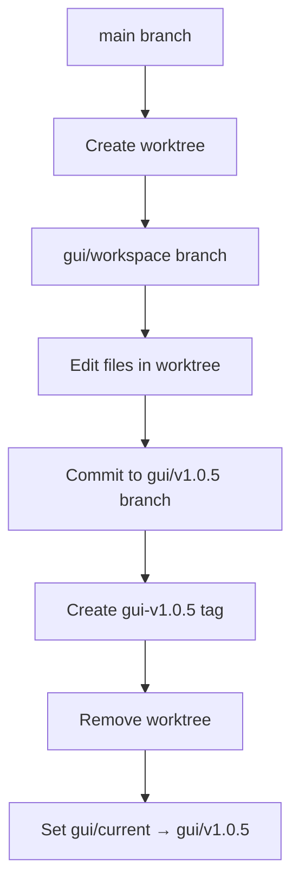
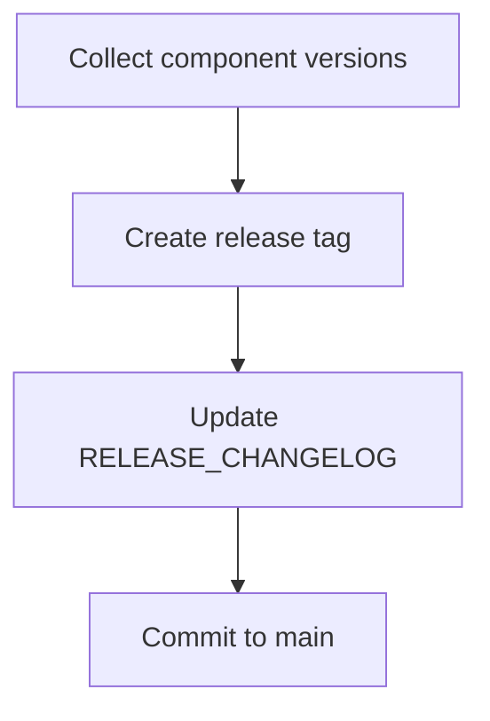

# Git Reference

Git branching, tagging, and workflow conventions for CBFlow versioning system.

## Branch Naming Convention

CBFlow uses a structured branch naming scheme to organize component versions.

### Format

```
<component>/<identifier>
```

**Examples:**
```
gui/v1.0.0                # Version branch
gui/v1.0.5                # Version branch
gui/current               # Symbolic ref (not a real branch)
gui/workspace             # Temporary workspace branch
config-flow/v1.0.0        # Nested component (path normalized)
utils-version/v2.0.0      # Nested component (path normalized)
```

### Component Path Normalization

Nested paths are normalized for Git branch names:
- `/` → `-` (forward slash to hyphen)
- Example: `config/flow` → `config-flow`
- Example: `utils/version` → `utils-version`

### Branch Types

| Type | Format | Purpose | Lifetime |
|------|--------|---------|----------|
| Version | `<component>/vX.Y.Z` | Store specific version | Permanent |
| Current | `<component>/current` | Symbolic ref to active version | Permanent (ref) |
| Workspace | `<component>/workspace` | Temporary development space | Temporary |
| Main | `main` or `master` | Main development branch | Permanent |

---

## Tag Naming Convention

Git tags mark specific versions for easy reference.

### Component Version Tags

**Format:**
```
<component>-vX.Y.Z
```

**Examples:**
```
gui-v1.0.0
gui-v1.0.5
config-flow-v1.0.0        # Nested: config/flow
utils-version-v2.0.0      # Nested: utils/version
```

**Purpose:**
- Quick reference to specific versions
- Easy checkout: `git checkout gui-v1.0.5`
- Release tracking

### Release Tags

**Format:**
```
release/vX.Y.Z
```

**Examples:**
```
release/v1.0.0
release/v1.0.1
release/v2.0.0
```

**Purpose:**
- Mark system-wide releases
- Bundle component versions
- Production milestones

---

## Symbolic References

### Component Current Reference

**Format:**
```
refs/heads/<component>/current → refs/heads/<component>/vX.Y.Z
```

**Purpose:**
- Points to the active version branch
- Allows `<component>/current` to track latest promoted version
- Updated when promoting versions

**Example:**
```bash
# Create symbolic ref
git symbolic-ref refs/heads/gui/current refs/heads/gui/v1.0.5

# Check symbolic ref
git symbolic-ref refs/heads/gui/current
# Output: refs/heads/gui/v1.0.5

# Use in commands
git log gui/current
git diff gui/current gui/v1.0.4
```

**Benefits:**
- No need to checkout branches
- `git log gui/current` shows active version history
- References are lightweight (no disk space)

---

## Git Worktree Structure

CBFlow uses Git worktrees for isolated development workspaces.

### Worktree Layout

```
.git/                                    # Main Git directory
workarea/
└── worktrees/
    ├── gui/
    │   └── workspace/                   # Git worktree
    │       ├── .git → ...               # Link to main .git
    │       └── <component files>
    └── config-flow/
        └── workspace/                   # Git worktree (normalized path)
            └── <component files>
```

### Worktree Branches

Each worktree has an associated temporary branch:

```
gui/workspace              # Temporary branch for gui worktree
config-flow/workspace      # Temporary branch for config/flow worktree
```

### Worktree Commands

```bash
# List all worktrees
git worktree list

# Add worktree (CBFlow does this automatically)
git worktree add workarea/worktrees/gui/workspace gui/workspace

# Remove worktree (CBFlow does this automatically)
git worktree remove workarea/worktrees/gui/workspace

# Prune deleted worktrees
git worktree prune
```

---

## Directory Structure

### Physical Directory Layout

```
gui/
├── CHANGELOG.md              # Component CHANGELOG (system-generated)
├── current -> v1.0.5         # Symlink to active version directory
├── v1.0.0/                   # Version directory (checked out from branch)
│   ├── launch_gui.sh
│   ├── README.md
│   └── simple_gui.py
├── v1.0.4/                   # Version directory
│   └── ...
└── v1.0.5/                   # Current version directory
    ├── launch_gui.sh
    ├── README.md
    └── simple_gui.py
```

### Git Branch Representation

```
Branches:
  main
  gui/current → gui/v1.0.5     (symbolic ref)
  gui/v1.0.0                   (branch, committed)
  gui/v1.0.4                   (branch, committed)
  gui/v1.0.5                   (branch, committed)

Tags:
  gui-v1.0.0
  gui-v1.0.4
  gui-v1.0.5

Worktrees:
  gui/workspace                (temporary, removed after commit)
```

---

## Git Workflow

### Version Creation Workflow



**Git commands executed:**
```bash
# 1. Create worktree
git worktree add workarea/worktrees/gui/workspace -b gui/workspace

# 2. User edits files...

# 3. Commit to version branch
cd workarea/worktrees/gui/workspace
git checkout -b gui/v1.0.5
git add -A
git commit -m "Version v1.0.5: Fixed button alignment"

# 4. Create tag
git tag gui-v1.0.5

# 5. Remove worktree
cd /path/to/core
git worktree remove workarea/worktrees/gui/workspace

# 6. Set current
git symbolic-ref refs/heads/gui/current refs/heads/gui/v1.0.5

# 7. Checkout to directory
git --work-tree=gui/v1.0.5 checkout gui/v1.0.5 -- .
```

### Release Workflow



**Git commands executed:**
```bash
# 1. Create release tag
git tag -a release/v1.0.0 -m "Release v1.0.0: Initial release"

# 2. Push tag
git push origin release/v1.0.0

# 3. Commit CHANGELOG to main
git add RELEASE_CHANGELOG.md
git commit -m "chore: Update RELEASE_CHANGELOG for v1.0.0"
git push origin main
```

---

## Branch Management

### Listing Branches

```bash
# All branches
git branch --all

# Component branches only
git branch --all | grep gui/

# Version branches only
git branch --all | grep '/v[0-9]'

# Workspace branches only
git branch --all | grep '/workspace'
```

### Checking Symbolic Refs

```bash
# Check specific ref
git symbolic-ref refs/heads/gui/current

# List all symbolic refs
git for-each-ref --format='%(refname) %(symref)' refs/heads/ | grep -v '^$'
```

### Cleaning Up Branches

```bash
# Delete version branch (careful!)
git branch -D gui/v1.0.0
git push origin --delete gui/v1.0.0

# Delete workspace branch
git branch -D gui/workspace

# Prune deleted remote branches
git fetch --prune
```

---

## Tag Management

### Listing Tags

```bash
# All tags
git tag

# Component tags only
git tag | grep '^gui-'

# Release tags only
git tag | grep '^release/'

# Tags with dates
git tag -l --format='%(refname:short) %(creatordate:short)'
```

### Creating Tags

```bash
# Lightweight tag
git tag gui-v1.0.5

# Annotated tag (recommended)
git tag -a gui-v1.0.5 -m "Version v1.0.5: Fixed button alignment"

# Tag specific commit
git tag gui-v1.0.5 a3d2f1c
```

### Deleting Tags

```bash
# Delete local tag
git tag -d gui-v1.0.5

# Delete remote tag
git push origin --delete gui-v1.0.5

# Delete both
git tag -d gui-v1.0.5
git push origin --delete gui-v1.0.5
```

---

## Git Operations

### Diff Operations

```bash
# Diff between version branches
git diff gui/v1.0.4 gui/v1.0.5

# Diff using tags
git diff gui-v1.0.4 gui-v1.0.5

# Diff with current
git diff gui/v1.0.4 gui/current

# Diff statistics
git diff --stat gui/v1.0.4 gui/v1.0.5

# Diff specific file
git diff gui/v1.0.4 gui/v1.0.5 -- simple_gui.py
```

### Log Operations

```bash
# Log for version branch
git log gui/v1.0.5

# Log for current
git log gui/current

# Log between versions
git log gui/v1.0.4..gui/v1.0.5

# One-line log
git log --oneline gui/v1.0.5

# Log with graph
git log --oneline --graph --all | grep gui
```

### Checkout Operations

```bash
# Checkout version branch
git checkout gui/v1.0.5

# Checkout to specific directory (sparse checkout)
git --work-tree=gui/v1.0.5 checkout gui/v1.0.5 -- .

# Checkout specific file from version
git checkout gui/v1.0.5 -- simple_gui.py
```

---

## Remote Operations

### Pushing Branches

```bash
# Push version branch
git push origin gui/v1.0.5

# Push all version branches
git push origin 'refs/heads/gui/v*'

# Push with tags
git push origin gui/v1.0.5 --tags
```

### Pushing Tags

```bash
# Push specific tag
git push origin gui-v1.0.5

# Push all tags
git push origin --tags

# Push release tags
git push origin 'refs/tags/release/*'
```

### Fetching

```bash
# Fetch all branches and tags
git fetch --all --tags

# Fetch specific component
git fetch origin 'refs/heads/gui/*:refs/heads/gui/*'

# Fetch with prune
git fetch --prune --tags
```

---

## Best Practices

### Branch Hygiene

- ✅ Keep main branch stable
- ✅ Create version branches from worktrees
- ✅ Delete workspace branches after commit
- ✅ Use symbolic refs for current versions
- ✅ Tag every version for easy reference
- ❌ Don't manually create version branches
- ❌ Don't checkout version branches directly
- ❌ Don't commit directly to version branches

### Tag Hygiene

- ✅ Use annotated tags for versions
- ✅ Include description in tag message
- ✅ Push tags with branches
- ✅ Use consistent tag naming
- ❌ Don't delete tags without backup
- ❌ Don't reuse tag names
- ❌ Don't create lightweight tags for releases

### Worktree Hygiene

- ✅ Clean up worktrees after use
- ✅ Run `git worktree prune` periodically
- ✅ Check `git worktree list` regularly
- ❌ Don't leave stale worktrees
- ❌ Don't manually delete worktree directories

### Symbolic Ref Hygiene

- ✅ Update symbolic refs when promoting
- ✅ Use symbolic refs for current tracking
- ✅ Check symbolic refs with `git symbolic-ref`
- ❌ Don't create circular symbolic refs
- ❌ Don't manually edit .git/refs files

---

## Troubleshooting

### Detached HEAD

```bash
# Problem: HEAD detached at gui/v1.0.5
git status

# Solution: Return to main branch
git checkout main
```

### Stale Worktrees

```bash
# Problem: Worktree directory exists but Git doesn't track it
git worktree list

# Solution: Prune stale worktrees
git worktree prune

# Or manually remove
git worktree remove workarea/worktrees/gui/workspace --force
```

### Orphaned Branches

```bash
# Problem: Workspace branch exists but worktree doesn't
git branch | grep workspace

# Solution: Delete orphaned branch
git branch -D gui/workspace
```

### Symbolic Ref Issues

```bash
# Problem: Symbolic ref points to non-existent branch
git symbolic-ref refs/heads/gui/current

# Solution: Update to valid branch
git symbolic-ref refs/heads/gui/current refs/heads/gui/v1.0.5
```

---

## Advanced Usage

### Cherry-Pick Between Versions

```bash
# Pick commit from one version to another
git checkout gui/v1.0.5
git cherry-pick <commit-hash-from-v1.0.4>
```

### Rebase Version Branch

```bash
# Rebase version branch (use with caution!)
git checkout gui/v1.0.5
git rebase main
```

### Archive Old Versions

```bash
# Create archive of old version
git archive --format=tar.gz gui/v1.0.0 > gui-v1.0.0.tar.gz

# Delete old version branch (after archiving)
git branch -D gui/v1.0.0
git tag -d gui-v1.0.0
```

---

## Git Configuration

### Recommended Settings

```bash
# Set default branch
git config --global init.defaultBranch main

# Set push behavior
git config --global push.default simple

# Enable color
git config --global color.ui auto

# Set editor
git config --global core.editor vim

# Set user info
git config --global user.name "Your Name"
git config --global user.email "your.email@example.com"
```

---

**See also:**
- [Makefile Reference](makefile-reference.md) - Make commands
- [Python Scripts Reference](python-scripts-reference.md) - Script details
- [Configuration Reference](configuration-reference.md) - Config formats
