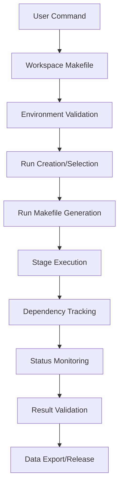

# CBFlow System Architecture Overview

## Introduction

CBFlow is a comprehensive physical design automation framework built on a modular, scalable architecture that separates concerns between configuration management, version control, execution orchestration, and tool integration. The system is designed for enterprise-scale deployment with robust error handling, parallel execution capabilities, and comprehensive monitoring.

## Architectural Principles

### 1. **Separation of Concerns**
- **Configuration Management**: Hierarchical configuration system with clear precedence
- **Execution Control**: Makefile-based orchestration with dependency tracking
- **Tool Integration**: Abstracted tool interfaces with version management
- **Data Management**: Structured data flow with validation and archiving

### 2. **Modular Design**
- **Flow Types**: Independent flow implementations with common interfaces
- **Script Versioning**: Version-controlled scripts with workspace development
- **Namespace Organization**: Clean separation of functionality areas
- **Plugin Architecture**: Extensible tool and flow integration

### 3. **Scalability and Performance**
- **Parallel Execution**: Multi-stage parallel processing with dependency tracking
- **Flat Mode Optimization**: Merged execution for performance-critical flows
- **Resource Management**: Efficient memory and disk usage patterns
- **Distributed Execution**: Support for cluster and grid computing

## System Components

### Core Directory Structure
```
CBFlow/PD/
├── core/                          # CBFlow core system
│   ├── config/                    # Configuration hierarchy
│   │   ├── flow/v1.0.0/          # Flow-specific configurations
│   │   ├── project/               # Project-specific settings
│   │   └── technology/            # Technology node configurations
│   ├── utils/                   # Versioned script library
│   │   ├── generation/v1.0.0/    # Makefile and config generation
│   │   ├── utilities/v1.0.0/     # Common utilities
│   │   ├── validation/v1.0.0/    # Validation and quality checks
│   │   └── node_management/v1.0.0/ # Node and branch management
│   ├── cmds/                      # Tool-specific command files
│   │   ├── SYNTH/genus/v1.0.0/   # Synthesis commands
│   │   ├── FP/innovus/v1.0.0/    # Floorplan commands
│   │   └── PNR/innovus/v1.0.0/   # Place & route commands
│   ├── docs/                      # Documentation system
│   └── Makefile                   # Core system management
└── workspace/                     # User workspace
    ├── Makefile                   # Workspace management
    ├── [run_directories]/         # Individual run instances
    └── .cbflow.env               # Environment configuration
```

### Configuration Hierarchy
CBFlow implements a 4-level hierarchical configuration system:

```
User Config (Highest Priority)
    ↓
Project Config
    ↓
Technology Config
    ↓
Flow Config (Lowest Priority)
```

Each level can override settings from lower levels, providing maximum flexibility while maintaining defaults.

### Script Version Management
All CBFlow scripts follow a structured versioning system:

```
utils/[category]/
├── v1.0.0/                # Stable production version
├── v1.0.1/                # Bug fix version
├── workspace/             # Development workspace
└── current/               # Symlink to active version
```

## Execution Architecture

### Makefile-Based Orchestration
CBFlow uses a three-tier Makefile system:

1. **Core Makefile** (`/core/Makefile`)
   - System version control and management
   - Script development and deployment
   - Release management

2. **Workspace Makefile** (`/workspace/Makefile`)
   - Environment setup and validation
   - Run creation and management
   - Node and branch management

3. **Run Makefiles** (`/[run_dir]/Makefile`)
   - Stage-specific execution control
   - Dependency tracking and parallel execution
   - Status monitoring and error handling

### Execution Flow


### Execution Modes

#### Regular Mode
- **Individual Stages**: Each stage executes independently
- **Maximum Flexibility**: Full control over each execution phase
- **Custom Nodes**: Support for user-defined execution variants
- **Branch Creation**: Parallel execution paths

#### Flat Mode
- **Merged Execution**: Multiple stages consolidated into single execution
- **Optimized Performance**: Reduced tool overhead and faster execution
- **Simplified Management**: Single merged node instead of multiple stages
- **Architecture Protection**: Prevents individual execution node creation

## Data Flow Architecture

### Input Processing
1. **Configuration Consolidation**: Merge hierarchical configurations
2. **Input Validation**: Comprehensive input file validation
3. **Environment Setup**: Tool-specific environment preparation
4. **Dependency Resolution**: Calculate stage execution order

### Stage Execution
1. **Setup Phase**: Stage-specific environment configuration
2. **Run Phase**: Core execution with tool integration
3. **Validation Phase**: Result quality and integrity checks
4. **Finish Phase**: Cleanup and next-stage preparation

### Output Management
1. **Result Packaging**: Structured output organization
2. **Quality Validation**: Comprehensive result validation
3. **Data Export**: Downstream flow preparation
4. **Archival**: Long-term storage and documentation

## Tool Integration Architecture

### Abstracted Tool Interface
CBFlow provides a unified interface for multiple EDA tools:

```tcl
# Tool configuration structure
array set [flow_type] {
    tool,vendor "cadence"
    tool,name "innovus"
    tool,version "v1.0.0"
    tool,args "-batch -no_gui"
    tool_mode "floorplan"
}
```

### Supported Tool Ecosystem
- **Synthesis**: Cadence Genus, Synopsys Design Compiler
- **Physical Design**: Cadence Innovus
- **Timing Analysis**: Synopsys PrimeTime, Cadence Tempus
- **Physical Verification**: Mentor Calibre, Synopsys ICV
- **Formal Verification**: Cadence Conformal, Synopsys Formality

### Tool Command Generation
CBFlow generates tool-specific command files with embedded flow_procs:

```tcl
# Generated tool command structure
flow_proc initialize_environment {
    # Environment setup procedures
}

flow_proc execute_main_task {
    # Core execution procedures
}

flow_proc validate_results {
    # Result validation procedures
}
```

## Namespace Architecture

CBFlow organizes functionality into clean namespaces:

### Core Namespaces
- **`::CBFlow::Directory`**: Directory management and structure
- **`::CBFlow::Logo`**: Branding and identification
- **`::CBFlow::Utilities`**: Common utility functions
- **`::CBFlow::NodeManagement`**: Node and branch management
- **`::CBFlow::Validation`**: Quality and validation checks

### Namespace Benefits
- **Collision Avoidance**: Prevents function name conflicts
- **Modular Organization**: Clear functional separation
- **Maintainability**: Easy to locate and modify functionality
- **Extensibility**: Simple to add new capability areas

## Monitoring and Validation Architecture

### Real-Time Status Tracking
CBFlow provides comprehensive status monitoring:

1. **Stamp Files**: Execution milestone tracking
2. **Status Files**: Detailed progress logging
3. **Log Analysis**: Automated error detection
4. **Dependency Validation**: Real-time dependency checking

### Quality Assurance Framework
- **Input Validation**: Pre-execution validation
- **Progress Monitoring**: Real-time execution tracking
- **Result Validation**: Post-execution quality checks
- **Error Detection**: Automated error identification and reporting

### Status Reporting System
```bash
# Status file format
[timestamp] [stage]_[subnode] [STATUS]

# Example status entries
20251007_143022 synthesis_setup COMPLETE
20251007_143155 synthesis_run COMPLETE
20251007_143201 synthesis_validate COMPLETE
```

## Error Handling Architecture

### Multi-Level Error Handling
1. **Input Validation**: Prevent errors before execution
2. **Runtime Monitoring**: Detect errors during execution
3. **Result Validation**: Catch errors in outputs
4. **Recovery Mechanisms**: Automated error recovery where possible

### Error Classification
- **Fatal Errors**: Stop execution immediately
- **Warning Conditions**: Log but continue execution
- **Quality Issues**: Flag for user attention
- **Performance Issues**: Monitor and optimize

### Recovery Strategies
- **Retrace Functionality**: Selective re-execution from failure points
- **Checkpoint Recovery**: Resume from intermediate checkpoints
- **Alternative Flows**: Fallback execution strategies
- **Manual Intervention**: Guided manual recovery processes

## Security and Access Control

### Environment Isolation
- **Run-Specific Environments**: Isolated execution environments
- **Tool Version Control**: Controlled tool access and versioning
- **Data Isolation**: Separated data access per run
- **Resource Limits**: Configurable resource usage limits

### Configuration Security
- **Hierarchical Permissions**: Access control per configuration level
- **Audit Trails**: Complete change tracking
- **Validation Gates**: Mandatory validation checkpoints
- **Backup Systems**: Automatic configuration backup

## Performance Architecture

### Parallel Execution
- **Stage-Level Parallelism**: Independent stages execute simultaneously
- **Subnode Parallelism**: Parallel execution within stages
- **Resource Scheduling**: Intelligent resource allocation
- **Load Balancing**: Distributed execution capabilities

### Memory Management
- **Efficient Data Structures**: Optimized memory usage
- **Garbage Collection**: Automatic cleanup of temporary data
- **Cache Management**: Intelligent caching of frequently accessed data
- **Resource Monitoring**: Real-time resource usage tracking

### I/O Optimization
- **Streaming Data**: Efficient large file handling
- **Compressed Storage**: Automatic compression of intermediate files
- **Network Optimization**: Optimized network file access
- **Parallel I/O**: Concurrent file operations where safe

## Extensibility Architecture

### Plugin System
CBFlow supports extensible plugin architecture:

- **Flow Plugins**: Custom flow type implementations
- **Tool Plugins**: Integration with new EDA tools
- **Validation Plugins**: Custom quality checks
- **Reporting Plugins**: Custom report generation

### API Framework
- **Script APIs**: Well-defined scripting interfaces
- **Configuration APIs**: Programmatic configuration access
- **Monitoring APIs**: Real-time status access
- **Integration APIs**: External tool integration

### Future Extensibility
- **Microservices Architecture**: Service-based component deployment
- **Container Support**: Docker/Kubernetes deployment
- **Cloud Integration**: Cloud-native execution capabilities
- **AI/ML Integration**: Intelligent optimization and prediction

---

This architecture provides a robust, scalable foundation for enterprise physical design automation while maintaining flexibility for diverse user requirements and future technological evolution.