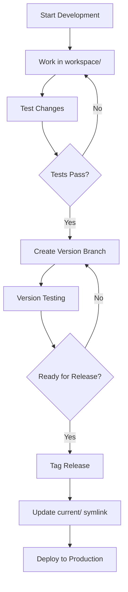

# CBFlow Version Management Architecture

## Overview

CBFlow implements a comprehensive version management system that provides systematic control over script evolution, workspace development, release management, and deployment. This architecture ensures stability in production while enabling continuous development and testing of new features.

## Versioning Philosophy

### Semantic Versioning
CBFlow follows semantic versioning principles:
```
MAJOR.MINOR.PATCH (e.g., v1.0.0, v1.2.3, v2.0.0)
```

- **MAJOR**: Incompatible API changes or major architectural changes
- **MINOR**: Backward-compatible functionality additions
- **PATCH**: Backward-compatible bug fixes

### Version Lifecycle
```
workspace → testing → v1.0.0 → v1.0.1 → v1.1.0 → v2.0.0
    ↓         ↓         ↓         ↓         ↓         ↓
  Active   Staging   Stable   Hotfix   Feature   Breaking
```

## Directory Structure

### Script Category Organization
```
utils/[category]/
├── v1.0.0/                    # Stable production version
├── v1.0.1/                    # Bug fix version
├── v1.1.0/                    # Feature version
├── v2.0.0/                    # Major version
├── workspace/                 # Active development
└── current/                   # Symlink to active version
```

### Version Directory Contents
```
utils/generation/v1.0.0/
├── gen_run_makefile.tcl       # Core generation script
├── generate_setup.tcl         # Setup generation
├── generate_config.tcl        # Configuration generation
├── VERSION                    # Version metadata file
├── CHANGELOG.md              # Version change log
└── tests/                    # Version-specific tests
```

### Categories with Version Management
All script categories follow this structure:
- **generation**: Makefile and configuration generation
- **utilities**: Common utility functions and procedures
- **validation**: Quality assurance and validation scripts
- **node_management**: Node and branch management
- **release**: Release packaging and management

## Version Control Workflow

### Development Workflow


### Core Makefile Version Commands

#### Version Creation
```makefile
# Create new version from workspace
make new_version VERSION=v1.1.0 CATEGORY=generation

# Implementation
new_version:
	@echo "Creating new version $(VERSION) for $(CATEGORY)"
	@$(SCRIPT_DIR)/new_version.tcl $(CATEGORY) workspace $(VERSION)
	@$(SCRIPT_DIR)/validate_version.tcl $(CATEGORY) $(VERSION)
```

#### Version Deployment
```makefile
# Deploy version to production
make deploy_version VERSION=v1.1.0 CATEGORY=generation

# Switch active version
make switch_version VERSION=v1.0.0 CATEGORY=generation
```

#### Version Management
```makefile
# List all versions
make list_versions CATEGORY=generation

# Compare versions
make diff_versions OLD=v1.0.0 NEW=v1.1.0 CATEGORY=generation

# Remove version
make remove_version VERSION=v1.0.1 CATEGORY=generation
```

## Workspace Development

### Workspace Structure
```
utils/[category]/workspace/
├── active_files/              # Currently modified files
├── backup/                    # Automatic backups
├── tests/                     # Development tests
├── docs/                      # Development documentation
└── .workspace_config          # Workspace configuration
```

### Development Environment
```tcl
# Workspace configuration
array set workspace_config {
    # Development settings
    debug_mode "true"
    logging_level "verbose"
    auto_backup "true"
    backup_interval "30"

    # Testing configuration
    test_mode "development"
    validation_level "strict"
    continuous_testing "true"

    # Source control
    track_changes "true"
    change_log "auto"
}
```

### Workspace Management Commands
```bash
# Activate workspace development
make workspace_start CATEGORY=generation

# Backup current workspace
make workspace_backup CATEGORY=generation

# Restore workspace from backup
make workspace_restore BACKUP_ID=20251007_143022 CATEGORY=generation

# Clean workspace
make workspace_clean CATEGORY=generation
```

## Version Metadata System

### VERSION File Format
```
# CBFlow Version Metadata
VERSION=v1.0.0
CATEGORY=generation
CREATED=2025-01-15T10:30:00Z
AUTHOR=cbflow-system
PARENT_VERSION=v0.9.0
RELEASE_TYPE=major

# Dependencies
REQUIRES_UTILS=v1.0.0
REQUIRES_CONFIG=v1.0.0
COMPATIBLE_FLOWS=SYNTH,FP,PNR,PV,FCT

# Testing Status
TESTS_PASSED=true
LAST_TESTED=2025-01-15T14:45:00Z
TEST_COVERAGE=95%

# Deployment Status
DEPLOYED=true
DEPLOYMENT_DATE=2025-01-15T16:00:00Z
PRODUCTION_READY=true
```

### CHANGELOG.md Format
```markdown
# Changelog - Generation Scripts v1.0.0

## [v1.0.0] - 2025-01-15

### Added
- Flat mode support for merged execution nodes
- Hierarchical configuration loading
- Advanced dependency tracking
- Runtime configuration validation

### Changed
- Improved error handling in gen_run_makefile.tcl
- Enhanced status reporting for makefile generation
- Optimized configuration processing performance

### Fixed
- Fixed hardcoded path issues in generate_setup.tcl
- Resolved namespace conflicts in configuration arrays
- Corrected dependency ordering in complex flows

### Breaking Changes
- Modified configuration array structure for flat mode
- Changed function signatures in generate_config.tcl
- Updated makefile template format

## [v0.9.0] - 2025-01-01
...
```

## Current Symlink Management

### Symlink Structure
```bash
# Current version pointers
utils/generation/current -> v1.0.0
utils/utilities/current -> v1.0.0
utils/validation/current -> v1.0.0
utils/node_management/current -> v1.0.0
utils/release/current -> v1.0.0
```

### Symlink Management Commands
```makefile
# Update current symlink
update_current:
	@echo "Updating current symlink for $(CATEGORY) to $(VERSION)"
	@cd $(CORE_DIR)/utils/$(CATEGORY) && \
		rm -f current && \
		ln -sf $(VERSION) current
	@$(SCRIPT_DIR)/validate_symlink.tcl $(CATEGORY) $(VERSION)

# Validate all symlinks
validate_symlinks:
	@echo "Validating all current symlinks"
	@$(SCRIPT_DIR)/validate_all_symlinks.tcl

# Rollback to previous version
rollback_version:
	@echo "Rolling back $(CATEGORY) to previous version"
	@$(SCRIPT_DIR)/rollback_version.tcl $(CATEGORY)
```

## Version Compatibility Matrix

### Cross-Category Compatibility
```tcl
# Compatibility requirements
array set version_compatibility {
    # generation v1.0.0 requirements
    generation,v1.0.0,utilities ">=v1.0.0"
    generation,v1.0.0,validation ">=v1.0.0"

    # utilities v1.0.0 requirements
    utilities,v1.0.0,generation ">=v1.0.0"
    utilities,v1.0.0,node_management ">=v1.0.0"

    # Flow compatibility
    SYNTH,supported_versions "v1.0.0,v1.1.0"
    FP,supported_versions "v1.0.0,v1.1.0"
    PNR,supported_versions "v1.0.0"
}
```

### Validation Process
```tcl
proc validate_version_compatibility {category version} {
    global version_compatibility

    # Check category requirements
    set required_keys [array names version_compatibility $category,$version,*]

    foreach key $required_keys {
        regexp {([^,]+),([^,]+),(.+)} $key -> cat ver dep_cat
        set required_version $version_compatibility($key)

        if {![check_version_requirement $dep_cat $required_version]} {
            error "Version $version of $category requires $dep_cat $required_version"
        }
    }

    return true
}
```

## Release Management

### Release Pipeline
```
1. Development → workspace/
2. Testing → testing_v1.0.0/
3. Staging → staging_v1.0.0/
4. Production → v1.0.0/
5. Deployment → current symlink update
```

### Release Commands
```makefile
# Complete release process
release_version:
	@echo "Starting release process for $(CATEGORY) $(VERSION)"
	@$(SCRIPT_DIR)/pre_release_validation.tcl $(CATEGORY) $(VERSION)
	@$(SCRIPT_DIR)/create_release_package.tcl $(CATEGORY) $(VERSION)
	@$(SCRIPT_DIR)/deploy_release.tcl $(CATEGORY) $(VERSION)
	@$(SCRIPT_DIR)/post_release_validation.tcl $(CATEGORY) $(VERSION)
	@echo "Release complete: $(CATEGORY) $(VERSION)"

# Emergency rollback
emergency_rollback:
	@echo "Emergency rollback for $(CATEGORY)"
	@$(SCRIPT_DIR)/emergency_rollback.tcl $(CATEGORY)
	@$(SCRIPT_DIR)/validate_rollback.tcl $(CATEGORY)
```

## Version Testing Framework

### Automated Testing
```tcl
proc run_version_tests {category version} {
    set test_dir "$CORE_DIR/utils/$category/$version/tests"

    if {![file isdirectory $test_dir]} {
        puts "Warning: No test directory for $category $version"
        return false
    }

    # Run all test files
    set test_files [glob -nocomplain $test_dir/*.test.tcl]
    set passed 0
    set failed 0

    foreach test_file $test_files {
        if {[run_test_file $test_file]} {
            incr passed
        } else {
            incr failed
        }
    }

    # Generate test report
    generate_test_report $category $version $passed $failed

    return [expr {$failed == 0}]
}
```

### Integration Testing
```makefile
# Run comprehensive version tests
test_version:
	@echo "Testing $(CATEGORY) version $(VERSION)"
	@$(SCRIPT_DIR)/run_unit_tests.tcl $(CATEGORY) $(VERSION)
	@$(SCRIPT_DIR)/run_integration_tests.tcl $(CATEGORY) $(VERSION)
	@$(SCRIPT_DIR)/run_regression_tests.tcl $(CATEGORY) $(VERSION)
	@$(SCRIPT_DIR)/generate_test_report.tcl $(CATEGORY) $(VERSION)
```

## Deployment Architecture

### Production Deployment
```tcl
proc deploy_to_production {category version} {
    # Pre-deployment validation
    validate_version_compatibility $category $version
    run_version_tests $category $version

    # Backup current production version
    backup_current_version $category

    # Deploy new version
    update_current_symlink $category $version

    # Post-deployment validation
    validate_deployment $category $version

    # Update deployment metadata
    update_deployment_metadata $category $version
}
```

### Rollback Procedures
```tcl
proc rollback_deployment {category} {
    # Get previous version
    set previous_version [get_previous_version $category]

    # Validate rollback target
    validate_rollback_target $category $previous_version

    # Perform rollback
    update_current_symlink $category $previous_version

    # Validate rollback success
    validate_rollback $category $previous_version

    # Log rollback event
    log_rollback_event $category $previous_version
}
```

## Version Migration

### Migration Framework
```tcl
proc migrate_version {category from_version to_version} {
    # Check migration path
    set migration_path [get_migration_path $from_version $to_version]

    foreach migration_step $migration_path {
        execute_migration_step $category $migration_step
    }

    # Validate migration
    validate_migration $category $from_version $to_version
}
```

### Migration Scripts
```bash
# Version migration utilities
utils/migration/
├── migrate_v0.9_to_v1.0.tcl    # Major version migration
├── migrate_v1.0_to_v1.1.tcl    # Minor version migration
├── migration_utils.tcl         # Common migration utilities
└── rollback_utils.tcl          # Migration rollback utilities
```

## Monitoring and Maintenance

### Version Health Monitoring
```tcl
proc monitor_version_health {} {
    foreach category {generation utilities validation node_management release} {
        set current_version [get_current_version $category]

        # Check version integrity
        validate_version_integrity $category $current_version

        # Check compatibility
        validate_cross_category_compatibility $category

        # Check performance metrics
        monitor_version_performance $category $current_version
    }
}
```

### Maintenance Commands
```makefile
# Regular maintenance tasks
version_maintenance:
	@echo "Performing version maintenance"
	@$(SCRIPT_DIR)/cleanup_old_versions.tcl
	@$(SCRIPT_DIR)/update_version_metadata.tcl
	@$(SCRIPT_DIR)/validate_all_versions.tcl
	@$(SCRIPT_DIR)/optimize_version_storage.tcl

# Health check
version_health:
	@echo "Checking version system health"
	@$(SCRIPT_DIR)/check_version_integrity.tcl
	@$(SCRIPT_DIR)/validate_symlinks.tcl
	@$(SCRIPT_DIR)/check_compatibility_matrix.tcl
```

## Best Practices

### Development Guidelines
1. **Always work in workspace**: Never modify versioned code directly
2. **Comprehensive testing**: Test all changes before version creation
3. **Clear documentation**: Update documentation with every version
4. **Semantic versioning**: Follow semantic versioning principles strictly

### Release Guidelines
1. **Staged deployment**: Use testing/staging before production
2. **Rollback preparation**: Always have rollback plan ready
3. **Compatibility validation**: Verify all compatibility requirements
4. **Change documentation**: Document all changes in CHANGELOG.md

### Maintenance Guidelines
1. **Regular cleanup**: Remove obsolete versions periodically
2. **Monitor performance**: Track version performance metrics
3. **Backup strategy**: Maintain comprehensive backup procedures
4. **Security updates**: Apply security patches promptly

---

CBFlow's version management system provides robust control over code evolution while maintaining production stability and enabling continuous development and improvement.